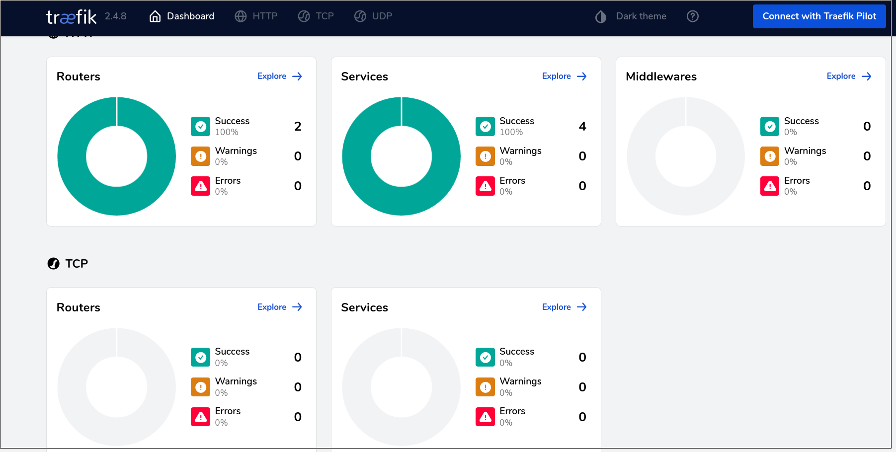

# mesos-m3s

[](https://matrix.to/#/#mesosk3s:matrix.aventer.biz?via=matrix.aventer.biz)
[](https://aventer-ug.github.io/mesos-m3s/index.html)

Mesos Framework to run Kubernetes (K3S)

## Requirements

- Apache Mesos min 1.6.0
- Mesos with SSL and Authentication is optional
- Persistent Storage to keep K3S data (not object storage)

## Run Framework

The following environment parameters are only a example. All parameters and der default values are documented in the `init.go` file (real documentation will be coming later)


```Bash
export FRAMEWORK_USER="root"
export FRAMEWORK_NAME="k3sframework"
export FRAMEWORK_PORT="10000"
export FRAMEWORK_ROLE="k3s"
export FRAMEWORK_STATEFILE_PATH="/tmp"
export MESOS_PRINCIPAL="<mesos_principal>"
export MESOS_USERNAME="<mesos_user>"
export MESOS_PASSWORD="<mesos_password>"
export MESOS_MASTER="<mesos_master_server>:5050"
export MESOS_CNI="weave"
export LOGLEVEL="DEBUG"
export DOMAIN="weave.local"
export K3S_SERVER_COUNT=1
export K3S_AGENT_COUNT=1
export ETCD_COUNT=1
export K3S_CPU=0.1
export K3S_MEM=1200
export ETCD_CPU=0.1
export ETCD_MEM=100
export AUTH_PASSWORD="password"
export AUTH_USERNAME="user"
export MESOS_SSL="true"
export IMAGE_K3S="ubunut:groovy"
export IMAGE_ETCD="bitnami/etcd:latest"
export VOLUME_DRIVER="rbd"
export VOLUME_K3S_SERVER="k3sserver"
export BOOTSTRAP_URL="https://raw.githubusercontent.com/AVENTER-UG/go-mesos-framework-k3s/master/bootstrap/bootstrap.sh"
export K3S_AGENT_LABELS='[
    {"key":"traefik.enable","value":"true"},
    {"key":"traefik.http.routers.m3s.entrypoints","value":"web"},
    {"key":"traefik.http.routers.m3s.service","value":"m3s-http"},
    {"key":"traefik.http.routers.m3s.rule","value":"Host(`*.example.com`)"}
]'

go run init.go app.go
```

# Screenshots

## Access Kubernetes Dashboard

```bash
kubectl -n kubernetes-dashboard describe secret admin-user-token | grep '^token'
kubectl proxy
```

http://localhost:8001/api/v1/namespaces/kubernetes-dashboard/services


## Apache Mesos running K3S Framework


## Access Traefik Dashboard

```bash
kubectl port-forward $(kubectl get pods --selector "app.kubernetes.io/name=traefik" --output=name -n kube-system) -n kube-system 9000:9000
```

http://127.0.0.1:9000/dashboard/



