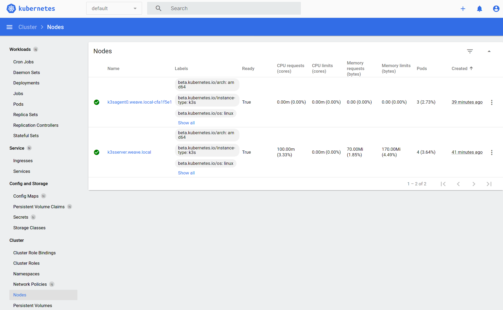
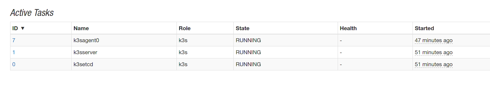

# go-mesos-framework-k3s

[](https://liberapay.com/mesos)
[](https://matrix.to/#/#mesosk3s:matrix.aventer.biz?via=matrix.aventer.biz)


Mesos Framework to run Kubernetes (K3S)

## Requirements

- Apache Mesos min 1.6.0
- Mesos with SSL and Authentication is optional
- Persistent Storage to keep K3S data (not object storage)

## Run Framework 

The following environment parameters are only a example. All parameters and der default values are documented in the `init.go` file (real documentation will be coming later)


```Bash
export FRAMEWORK_USER="root"
export FRAMEWORK_NAME="k3sframework"
export FRAMEWORK_PORT="10000"
export FRAMEWORK_ROLE="k3s"
export FRAMEWORK_STATEFILE_PATH="/tmp"
export MESOS_PRINCIPAL="<mesos_principal>"
export MESOS_USERNAME="<mesos_user>"
export MESOS_PASSWORD="<mesos_password>"
export MESOS_MASTER="<mesos_master_server>:5050"
export MESOS_CNI="weave"
export LOGLEVEL="DEBUG"
export DOMAIN="weave.local"
export K3S_SERVER_COUNT=1
export K3S_AGENT_COUNT=1
export ETCD_COUNT=1
export K3S_CPU=0.1
export K3S_MEM=1200
export ETCD_CPU=0.1
export ETCD_MEM=100
export AUTH_PASSWORD="password"
export AUTH_USERNAME="user"
export MESOS_SSL="true"
export IMAGE_K3S="ubunut:groovy"
export IMAGE_ETCD="bitnami/etcd:latest"
export VOLUME_DRIVER="rbd"
export VOLUME_K3S_SERVER="k3sserver"
export BOOTSTRAP_URL="https://raw.githubusercontent.com/AVENTER-UG/go-mesos-framework-k3s/master/bootstrap/bootstrap.sh"

go run init.go app.go
```

## Get mesos task status

```Bash
curl -X GET 127.0.0.1:10000/v0/container/<taskId> -d 'JSON'  | jq
```

## Reflate missing K3S server or agent

```Bash
curl -X GET 127.0.0.1:10000/v0/<server|agent>/reflate -d 'JSON'
```

## Scale up/down K3S Server, Agent, Etcd

```Bash
curl -X GET 127.0.0.1:10000/v0/<server|agent|etcd>/scale/<count> -d 'JSON'
```

## Task killen

```Bash
curl -X GET 127.0.0.1:10000/v0/task/kill/<taskId> -d 'JSON'
```

## Get Kubeconfig

```Bash
curl -X GET 127.0.0.1:10000/v0/k3s/config -d 'JSON'
```

# Screenshots

## Kubernetes Dashboard



## Apache Mesos running K3S Framework


