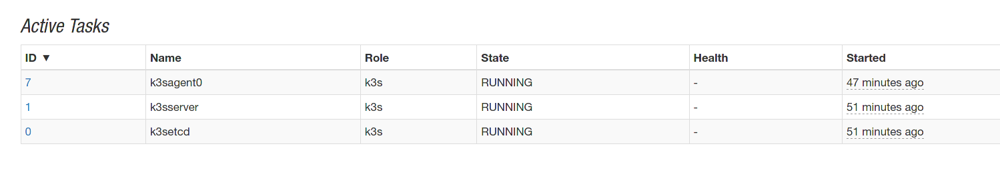

# M3s - Apache Mesos Kubernetes Framework

## Introduction

M3s is a Golang based Apache Mesos Framework to run and deploy Kubernetes through K3s from Rancher.

## Requirements


- Apache Mesos min 1.6.0
- Mesos with SSL and Authentication is optional
- Persistent Storage to store Kubernetes data

## How To use

Before we can run the following M3s example, we have to creat a docker network.

```bash
docker network create --subnet 10.32.0.0/24 mini
```

Afte that, we can create a docker-compose file to run the services we need.

```yaml
version: '3'
services:
  redis:
    image: redis
  m3s:
    image: avhost/mesos-m3s:master
    depends: redis
    environment:
    - LOGLEVEL="debug"
    - DOMAIN=.mini
    - DOCKER_CNI=mini
    - K3S_AGENT_COUNT=1
    - REDIS_SERVER=redis.mini:6379
    - K3S_TOKEN=l9WpVPQQw2sfNQRbxJDXjZx61wMpXDaB
    - VOLUME_K3S_SERVER="local_k3sserver"
    - AUTH_USERNAME=user
    - AUTH_PASSWORD=password
    ports:
      - 10000
```

After that, we can execute docker-compose in the same directory where we have created our compose file.

```bash
docker compose up
```

If Kubernetes is running inside of M3s, we can export the kubeconfig file with our mesos-cli or with a simple
API call.

```bash
curl -k -X GET http://127.0.0.1:10000/api/m3s/v0/server/config
```

No we can use kubectl and all other Kubernetes specified commands.

```bash
kubectl get nodes
NAME                     STATUS   ROLES                  AGE   VERSION
m3sserver.mini           Ready    control-plane,master   18h   v1.24.4+k3s1
m3sagent.mini-8aee249f   Ready    <none>                 17h   v1.24.4+k3s1
```

## Screenshots

### Mesos




### Kubernetes Dashboard

Get the token and start the proxy.

```bash

kubectl -n kubernetes-dashboard create token admin-user
kubectl proxy

```

And then open the browser:

[Kubernetes Dashboard](http://localhost:8001/api/v1/namespaces/kubernetes-dashboard/services/https:kubernetes-dashboard:/proxy/)


### Traefik

```bash

kubectl port-forward $(kubectl get pods --selector "app.kubernetes.io/name=traefik" --output=name -n kube-system) -n kube-system 9000:9000

```

And then open the browser:

[http://localhost:9000/dashboard](http://localhost:9000/dashboard)


